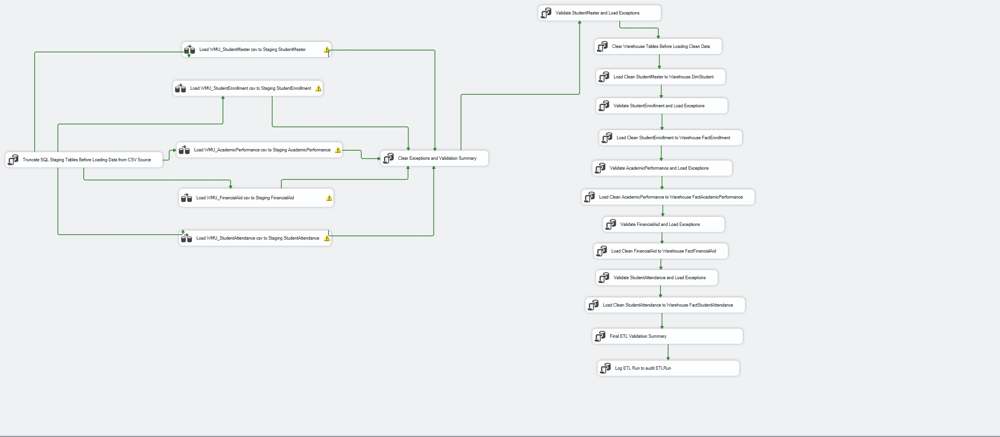
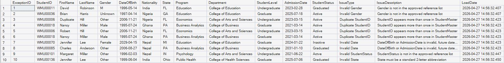
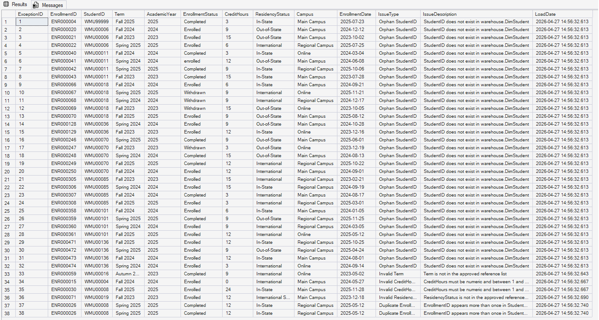
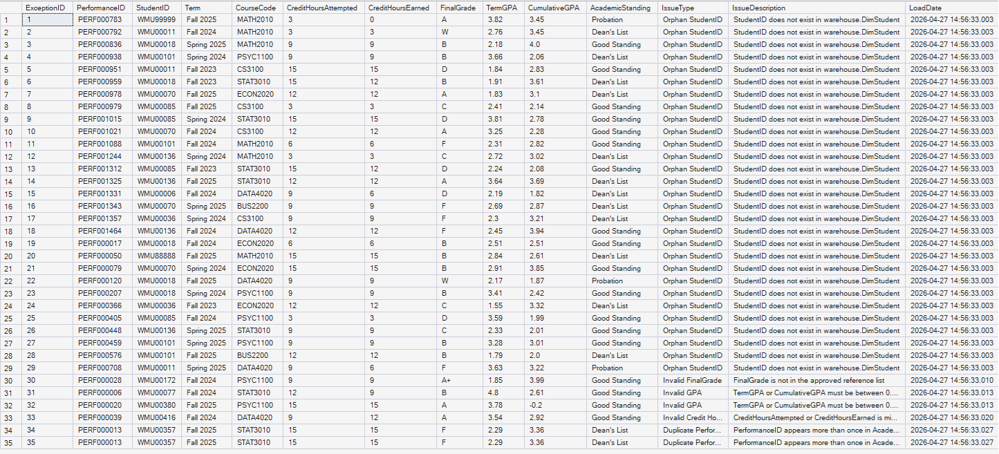
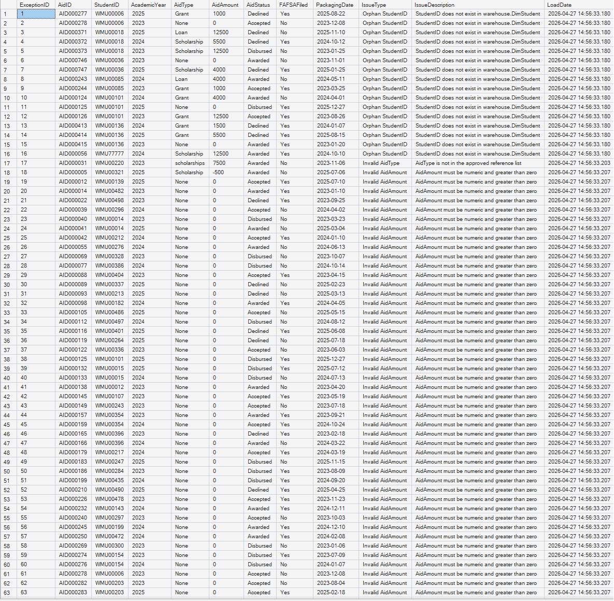
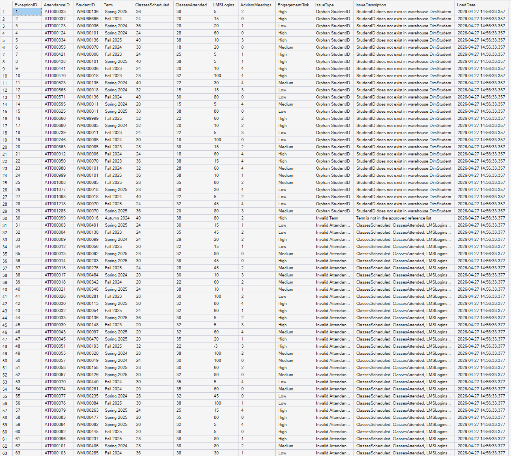
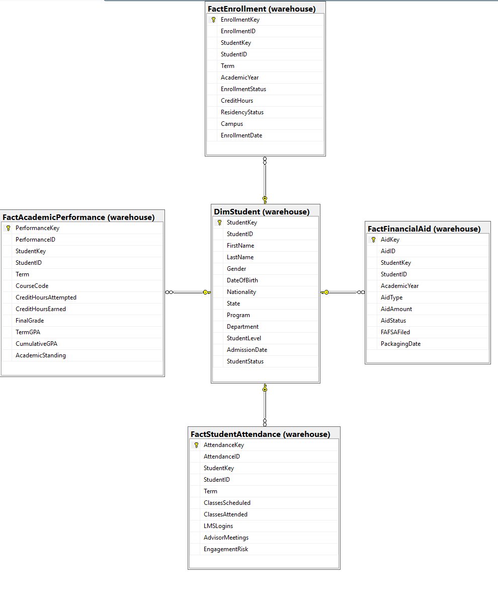
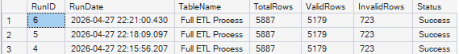
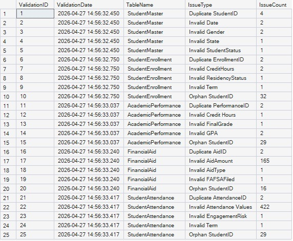

# WMU Student Information ETL & Data Warehouse Project

## 1. Project Overview

WMU (Western Midlands University) is a fictional higher education institution used for this project. This end-to-end SSIS ETL and SQL Server Data Warehouse project was designed to integrate student data from multiple source files into a structured reporting environment for institutional analytics and decision-making.

The project uses a full refresh ETL process with staging tables, reference tables, exception handling, audit reporting, and warehouse star schema design to ensure data quality, validation, and reliable reporting.

The final solution supports Power BI-ready institutional reporting by transforming raw CSV source files into clean warehouse tables for enrollment, academic performance, financial aid, and student attendance analysis.

---

## 2. Business Problem

Higher education institutions manage student data across multiple operational systems such as admissions, enrollment, academics, financial aid, and student engagement platforms. These systems often store transactional data separately, making reporting difficult, inconsistent, and time-consuming.

Without a structured ETL process and centralized warehouse, institutional reporting can suffer from:

- duplicate student records
- invalid data values
- inconsistent reporting definitions
- poor audit visibility
- unreliable decision-making

This project solves that problem by creating a full ETL pipeline that extracts raw student data from CSV source files, validates data quality using business rules, isolates bad records into exception tables, and loads clean records into a reporting-ready star schema warehouse.

---

## 3. Project Objectives

The main objectives of this project were:

- build a full refresh ETL process using SSIS and SQL Server
- create staging, reference, exception, audit, and warehouse schemas
- validate student records using controlled business rules
- isolate invalid records into exception tables for correction
- load clean validated data into warehouse dimension and fact tables
- implement audit reporting for ETL monitoring and validation tracking
- support Power BI-ready institutional reporting and analytics

---

## 4. Tools Used

### ETL & Database

- SQL Server Management Studio (SSMS)
- SQL Server Integration Services (SSIS)
- Microsoft SQL Server
- Visual Studio (SSDT)

### Reporting & Validation

- Power BI (reporting-ready warehouse output)
- Microsoft Excel / CSV source files

### Development & Version Control

- GitHub
- GitHub README documentation

---

## 5. ETL Architecture

The project follows a full refresh ETL architecture:

```text
Source CSV Files
        ↓
Staging Tables
        ↓
Reference Table Validation
        ↓
Exception Tables (Invalid Records)
        ↓
Warehouse Tables (Clean Records Only)
        ↓
Audit Tables (Validation Summary + ETL Run)
        ↓
Power BI Reporting
```

### ETL Process Flow

### SSIS Control Flow



1. Truncate SQL staging tables before loading data from CSV source
2. Load csv fikes to SQL staging tables
3. Clear exceptions and validation summary  
4. Validate StudentMaster and load invalid records into exceptions.StudentMaster  
5. Clear warehouse tables before loading clean data  
6. Load clean StudentMaster records to warehouse.DimStudent  
7. Validate StudentEnrollment and load invalid records into exceptions.StudentEnrollment  
8. Load clean StudentEnrollment records to warehouse.FactEnrollment  
9. Validate AcademicPerformance and load invalid records into exceptions.AcademicPerformance  
10. Load clean AcademicPerformance records to warehouse.FactAcademicPerformance  
11. Validate FinancialAid and load invalid records into exceptions.FinancialAid  
12. Load clean FinancialAid records to warehouse.FactFinancialAid  
13. Validate StudentAttendance and load invalid records into exceptions.StudentAttendance  
14. Load clean StudentAttendance records to warehouse.FactStudentAttendance  
15. Generate final ETL validation summary  
16. Log ETL execution into audit.ETLRun  

---

## 6. Validation Rules

Data quality validation was implemented using SQL business rules supported by reference tables and exception handling logic.

### Example Validation Rules

### StudentMaster

- valid Gender values: Male, Female, Other
- valid StudentLevel values: Undergraduate, Graduate
- valid StudentStatus values: Active, Inactive, Graduated
- duplicate StudentID detection
- invalid DateOfBirth handling using TRY_CONVERT()

### StudentEnrollment

- orphan StudentID detection
- valid EnrollmentStatus values
- valid CreditHours range (1–18)
- valid ResidencyStatus values
- valid Campus values

### AcademicPerformance

- valid FinalGrade values: A, B, C, D, F, W
- valid GPA range: 0.00–4.00
- valid AcademicStanding values
- duplicate PerformanceID detection
- credit hours validation

### FinancialAid

- valid AidType values
- valid AidAmount checks
- valid FAFSAFiled values
- duplicate AidID detection

### StudentAttendance

- valid attendance values
- valid LMS login checks
- valid AdvisorMeetings values
- valid EngagementRisk values

---

## 7. Exception Handling


Invalid records were never loaded into the warehouse.

Instead, failed records were redirected into dedicated exception tables:

- exceptions.StudentMaster
- exceptions.StudentEnrollment
- exceptions.AcademicPerformance
- exceptions.FinancialAid
- exceptions.StudentAttendance

### AcademicPerformance Exceptions

### exceptions.StudentMaster



---

### exceptions.StudentEnrollment



---

### exceptions.AcademicPerformance




---

### exceptions.FinancialAid



---

### exceptions.StudentAttendance



Each exception record stored:

- IssueType
- IssueDescription
- source record details

This approach ensured full data quality control, audit transparency, and correction-ready exception reporting.

---

## 8. Warehouse Design

### Warehouse Star Schema Diagram



The final warehouse was built using a star schema design to support institutional reporting, Power BI dashboards, and analytics.

Only clean validated records were loaded into the warehouse.

### Dimension Table

### warehouse.DimStudent

This central dimension stores student profile information including:

- StudentID
- FirstName
- LastName
- Gender
- DateOfBirth
- Nationality
- State
- program
- Department
- StudentLevel
- AdmissionDate
- StudentStatus
  

A surrogate key:

```text
StudentKey
```

was used as the warehouse primary key.

### Fact Tables

### warehouse.FactEnrollment

Stores enrollment activity:

- EnrollmentID
- Term
- EnrollmentStatus
- CreditHours
- ResidencyStatus
- Campus

### warehouse.FactAcademicPerformance

Stores academic outcomes:

- PerformanceID
- CourseCode
- FinalGrade
- CreditHoursAttempted
- CreditHoursEarned
- TermGPA
- CumulativeGPA
- AcademicStanding

### warehouse.FactFinancialAid

Stores financial aid information:

- AidID
- AidType
- AidAmount
- FAFSAFiled
- AidStatus

### warehouse.FactStudentAttendance

Stores engagement and attendance:

- AttendanceID
- ClassesScheduled
- ClassesAttended
- LMSLogins
- AdvisorMeetings
- EngagementRisk

All fact tables were linked to:

```text
warehouse.DimStudent
```

using:

```text
StudentKey
```

which created a reporting-ready star schema structure for analytics and dashboard development.

---

## 9. Audit Reporting

To support ETL monitoring and data quality reporting, two audit tables were implemented:

### audit.ValidationSummary

This table provides a summary of validation issues found during ETL processing.

It answers:

- what issues were found
- which table had the issue
- how many records were affected

Example issues include:

- Invalid Gender
- Duplicate StudentID
- Invalid GPA
- Invalid Attendance Values

This supports management reporting and data governance review.

### audit.ETLRun


This table stores ETL execution history and final ETL performance metrics.

It records:

- RunDate
- TableName
- TotalRows
- ValidRows
- InvalidRows
- Status

This supports ETL monitoring, execution tracking, and audit history.

---

## 10. Final ETL Results

The final ETL execution produced the following results:

```text
TotalRows   = 5887
ValidRows   = 5179
InvalidRows = 723
Status      = Success
```

### Validation Consistency Proof

The project ensured consistency between validation reporting and ETL execution logging:

### Validation Summary Table



```text
audit.ValidationSummary total issues = 723
audit.ETLRun InvalidRows = 723
```

This proves that:

- validation rules executed correctly
- invalid rows were successfully isolated into exception tables
- only clean validated records entered the warehouse
- audit reporting matched actual ETL outcomes

This level of consistency is critical in enterprise ETL systems and strengthens reporting reliability.

---

## 11. Key Project Outcomes

This project successfully delivered a complete end-to-end ETL and data warehouse solution for higher education student reporting.

### Key Outcomes

- built a full refresh ETL process using SSIS and SQL Server
- created structured schemas for staging, reference, exceptions, audit, and warehouse
- implemented strong validation rules for data quality control
- isolated invalid records into exception tables instead of loading bad data into the warehouse
- loaded only clean validated records into star schema warehouse tables
- implemented audit reporting using ValidationSummary and ETLRun
- created Power BI-ready warehouse outputs for reporting and analytics
- documented the full project using GitHub for portfolio and interview presentation

---

## 12. Business Value

This solution improves institutional reporting by creating a trusted single source of truth for student data.

It supports:

- accurate enrollment reporting
- academic performance tracking
- financial aid monitoring
- student engagement analysis
- stronger audit visibility
- better decision-making for institutional leadership

The warehouse structure was designed to support Power BI dashboards for enrollment trends, student performance monitoring, financial aid reporting, and student engagement analysis.

Instead of reporting from disconnected operational systems, WMU can now use a clean, validated warehouse structure for reliable analytics and long-term planning.

---

## 13. Author

**Wanangwa Msiska**

Data Analyst | Power BI Developer | ETL & Data Warehouse Projects | Institutional Research & Analytics
